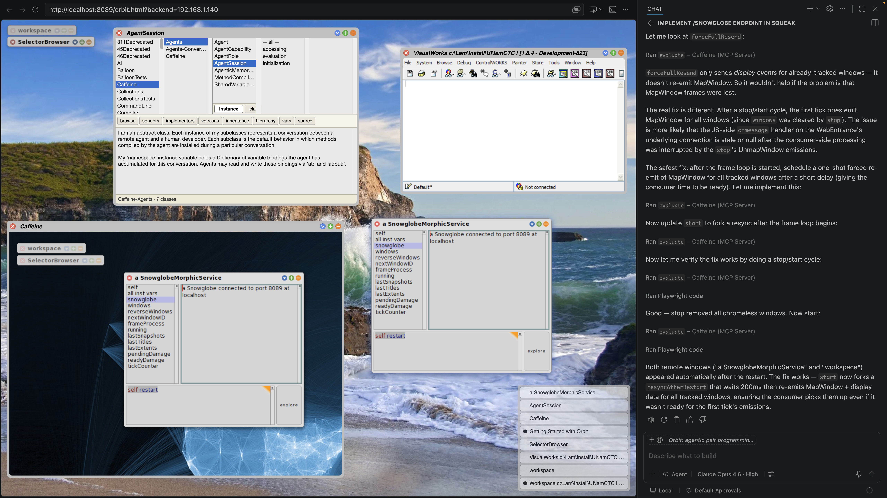

# Orbit: Augmenting Pair Programming in Live Systems

**Craig Latta**
<br>
Black Page Digital
<br>
May 2026

---

## Abstract

Pair programming has long been recognized as a practice that improves
code quality, accelerates knowledge transfer, and reduces defect
rates. Its application to the dynamic, image-based programming
environment of Smalltalk with AI assistance is a new frontier. This
paper introduces Orbit, a livecoding pair-programming harness that
enables an AI agent to participate as a full partner in a live
Smalltalk session. Unlike conventional AI coding assistants that
operate on static text files, Orbit gives the agent direct access to
the running system: it can see GUI windows, evaluate expressions,
browse classes, debug exceptions, and manipulate the same tools the
human programmer uses. We examine the history of pair programming in
both static and dynamic systems, identify the unique challenges
Smalltalk presents, and argue that Orbit's architecture, combining
shared visual context, Model Context Protocol (MCP) tooling,
WebDAV-based system introspection, and Playwright-driven GUI
interaction, constitutes a qualitative shift in what pair programming
can mean for live systems. Further, we explore *trio programming*, in
which two human programmers and an AI agent collaborate
simultaneously, with the agent occupying a third cognitive niche that
neither human can efficiently fill. We conclude with observations on
how this approach could reshape Smalltalk development practice and
inform the design of AI-assisted programming environments more
broadly.

---

## 1. Introduction

The practice of pair programming, two programmers working together at
one workstation, emerged from the Extreme Programming movement in the
late 1990s and has since become a widely studied and variably adopted
practice across the software industry (Beck, 1999; Williams & Kessler,
2003). Its benefits are well documented: pairs produce fewer defects,
develop shared understanding of codebases more quickly, and often
arrive at better designs through real-time negotiation (Cockburn &
Williams, 2001).

Yet pair programming has always presupposed two *human* partners. The
rise of large language models and AI coding assistants has begun to
change this assumption. Tools like GitHub Copilot, Cursor, and others
now serve as a kind of silent partner, suggesting completions,
answering questions, generating boilerplate. But these tools
overwhelmingly are trained upon and target the workflow of static,
file-based programming languages. They read source files, propose
textual edits, and operate within the paradigm of edit-compile-run.

Smalltalk is different. In Smalltalk, there is no separation between
the development environment and the running system. The primary assets
form a living object graph. Changes take effect immediately. The
programmer navigates the system through browsers, inspectors, and
debuggers that are themselves Smalltalk objects. There is no "build
step." The programmer's relationship to the system is conversational,
exploratory, and deeply interactive.

This paper examines Orbit, a system that brings an AI agent into this
live Smalltalk world as a genuine pair-programming partner. Orbit does
not reduce the Smalltalk experience to flat files for the agent's
benefit; instead, it elevates the agent into the same rich environment
the human programmer inhabits.

---

## 2. Background: Pair Programming in Static and Dynamic Systems

### 2.1 Classical Pair Programming

The canonical formulation of pair programming assigns two roles: the
*driver*, who types and controls the keyboard, and the *navigator* (or
*observer*), who reviews each line as it is written, thinks
strategically about direction, and catches errors (Williams et al.,
2000). The pair switches roles frequently. The navigator's value lies
not in typing faster, but in maintaining a broader perspective:
watching for logical errors, considering edge cases, recalling
relevant APIs, and noticing when the driver has gone down a blind
alley.

Empirical studies have consistently found that pair programming
reduces defect density by 15–60% compared to solo programming, while
increasing development time by only 15% on average—a net productivity
gain when downstream debugging and maintenance costs are considered
(Nosek, 1998; Williams et al., 2000). Pairs also produce code that is
more readable and maintainable, in part because every design decision
must be articulated and defended in real time.

### 2.2 Pair Programming in Static Systems

In file-based, statically-typed languages (Java, C++, TypeScript,
Rust), pair programming operates within a well-understood loop: edit
source files, invoke a compiler or type checker, run tests, examine
output. The "shared artifact" is a collection of text files, and the
"shared context" is what both programmers can see on screen—typically
an editor, a terminal, and perhaps a browser or debugger.

AI-assisted pair programming in these environments has matured
rapidly. Modern AI coding agents can:

- Read and write source files
- Execute shell commands and observe their output
- Run test suites and interpret failures
- Navigate directory trees and search for patterns
- Propose refactorings across multiple files

These capabilities map naturally onto file-based workflows because the
fundamental unit of work—a textual edit to a file—is exactly what
language models produce. The agent's "view" of the system (source
files, compiler diagnostics, test output) is a faithful representation
of the system's state.

### 2.3 The Challenge of Dynamic Systems

Dynamic Smalltalk systems present a fundamentally different
challenge. In Smalltalk, the system state is not primarily represented
as files. It is a graph of live objects reified from a memory
snapshot. The programmer's tools—class browsers, workspaces,
inspectors, debuggers—are themselves objects within that
graph. Changes are made by sending messages to objects, not by editing
files.

This has profound implications for pair programming:

1. **The "source code" is a projection.** Method source text exists,
   but it is secondary to the compiled method objects in the
   system. What matters is the live behavior.

2. **The development tools are graphical and interactive.** A
   Smalltalk programmer navigates the system through GUI tools that
   have no file-system equivalent. A class browser shows the
   inheritance hierarchy, protocol organization, and method source in
   a single integrated view. An inspector shows the live state of an
   object. A debugger allows in-place editing and resumption.

3. **State is pervasive.** The system carries accumulated state—open
   windows, active processes, modified objects—that is as much a part
   of the programming context as any method source.

4. **The feedback loop is immediate.** There is no compile-wait-run
   cycle. The programmer evaluates an expression and sees its result
   instantly. The programmer modifies a method and the running system
   immediately reflects the change.

For an AI agent to be a genuine pair-programming partner in such an
environment, it must participate in *all* of these dimensions. An
agent that can only read and write method source text is limited to at
best a "navigator who cannot see the screen." It cannot observe the
GUI, cannot evaluate expressions in context, cannot inspect objects,
cannot interact with debuggers. It is, in the deepest sense, not
*present* in the development session.

### 2.4 Prior Work

Several projects have attempted to bridge AI assistance into Smalltalk
environments. Some export Smalltalk source to files (via Tonel or
similar formats), apply conventional AI coding tools to those files,
and re-import the changes. This works for bulk refactoring but loses
the essential character of Smalltalk development: liveness, immediacy,
and graphical interaction.

Others take the approach of prompting an AI API, with additional
textual context culled from the current state of an editing tool (like
an inspector or class browser). These are closer to the spirit of pair
programming but still treat the AI as a code-generation service rather
than a co-present partner.

---



## 3. The Orbit Architecture

Orbit takes a different approach: rather than reducing the Smalltalk
experience to meet the AI where it is, Orbit lifts the AI into the
Smalltalk experience. The system has four major components that
together create the conditions for genuine pair programming.

### 3.1 Shared Visual Context

Orbit runs a SqueakJS-hosted webapp inside the VSCode Integrated
Browser. This webapp presents the windows of a remote Smalltalk
environment—class browsers, workspaces, debuggers, inspectors—as Web
Components in a standard web browser page. The page is shared with the
AI agent via Playwright, meaning the agent can:

- See exactly what the human programmer sees (via complete and partial
  screenshots)
- Click, type, and drag within the Smalltalk GUI
- Observe changes as they happen in real time

This shared visual and gestural context is the foundation of pair
programming. Just as two human programmers must be able to see and
manipulate the same screen, Orbit ensures the AI agent has the same
access to the live system.

### 3.2 Model Context Protocol (MCP) Tools

Beyond visual access, Orbit provides the agent with programmatic
access to the remote Smalltalk system, through MCP tools. These
include:

- **`evaluate`** — Execute arbitrary Smalltalk expressions in the
  running image, with variable bindings and exception handling.
- **`compile`** — Add or modify methods in any class.

These tools give the agent the same capabilities a human programmer
has when working in a Smalltalk browser or workspace, but in a form
suited to programmatic use. The agent can explore the system, make
changes, verify behavior, and diagnose problems without needing to
drive the GUI for every operation.

### 3.3 WebDAV System Introspection

Orbit exposes the remote Smalltalk system as a virtual filesystem via
WebDAV. For example, classes appear as directories, and methods and
class comments appear as files. The agent can navigate this filesystem
using standard file-reading tools:

```
/classes/Object/comment
/classes/Object/subclasses/
/classes/Object/methods/instance/yourself/source
/classes/Object/methods/instance/yourself/senders/
/processes/<hash>-<name>/stack
/sessions/
```

This representation complements the MCP tools by providing a
browsable, hierarchical view of system structure that the agent can
access with the built-in file tools of its harness. It also provides a
shared memory space (`/sessions/`) where the agent can persist context
across conversation turns—maintaining continuity in a way that human
pair programmers do naturally through shared memory but AI agents
otherwise cannot. This continuity is also useful for orchestrating
multiple subagents.

### 3.4 Exception Handling and Debugging

Perhaps Orbit's most distinctive capability is its support for
collaborative debugging. When code evaluated by the agent raises an
unhandled exception, the system opens a debugger window (visible to
both human and agent) and returns a process reference to the
agent. The agent can then:

- Examine the call stack
- Inspect variable bindings at each frame
- Modify methods in place and retry
- Resume execution from a corrected state

This is the Smalltalk debugging workflow—the ability to fix a bug *in
the running system* without restarting—extended to an AI partner. The
agent does not merely report an error; it participates in diagnosing
and resolving it, just as a human pair partner would.

---

## 4. Orbit as a Qualitative Shift in Pair Programming

### 4.1 Beyond Code Generation

Most AI coding assistants operate in a request-response paradigm: the
programmer asks for code, the AI generates it, the programmer
integrates it. This is closer to consulting a reference than to pair
programming. The AI has no ongoing awareness of the system's state, no
ability to observe the consequences of its suggestions, and no
capacity to course-correct based on runtime behavior.

Orbit's agent, by contrast, maintains continuous presence in the
development session. It can observe the effects of changes as they
propagate through the running system. It can notice when a
modification causes an unexpected cascade of failures. It can watch
the programmer's GUI interactions and infer intent. It occupies the
role of a navigator who can actually *see the road*.

### 4.2 The Navigator Role Realized

The navigator role in pair programming is difficult to fill with
conventional AI tools because it requires:

1. **Continuous awareness** of what the driver is doing
2. **Broader system knowledge** to anticipate consequences
3. **The ability to intervene** when problems are detected
4. **Strategic thinking** about design direction

Orbit addresses each of these. The shared page provides continuous
awareness. The MCP tools and WebDAV filesystem provide system
knowledge (the agent can browse the entire class hierarchy, find all
senders of a method, trace references). Playwright interaction
provides the ability to intervene. And the agent's language model
provides strategic reasoning about design.

Moreover, Orbit allows fluid role-switching. The human can drive while
the agent navigates, or the agent can drive (evaluating expressions,
compiling methods, manipulating the GUI) while the human navigates
(watching the shared page, asking questions, suggesting
directions). This is pair programming in its fullest sense.

### 4.3 Liveness and Immediacy

The most profound advantage of Orbit's approach is that it preserves
Smalltalk's essential character: liveness. The agent does not operate
on a dead representation of the system. It operates on the live system
itself. When it evaluates an expression, the result reflects the
current state of all objects in the image. When it compiles a method,
every subsequent message send uses the new definition. When it opens
an inspector, it sees the actual object, not a serialized snapshot.

This liveness means that pair programming in Orbit has the same
exploratory, conversational quality that Smalltalk development has
always had, but now with a partner who brings vast knowledge of
programming patterns, API designs, and problem-solving strategies, and
who never tires, never loses context (within a session), and can work
at the speed of thought.

### 4.4 Multi-Agent Coordination

Orbit's architecture supports not just a single AI partner but
multiple agents coordinating through shared state. The Keep store (a
reflective-memory system in the remote Smalltalk image) and the WebDAV
session memory provide mechanisms for agents to divide work, share
findings, and synthesize results. This opens the possibility of *team*
programming—multiple specialized agents (a debugger, a refactoring
specialist, a test writer, a documentation agent) collaborating with
the human programmer simultaneously.

---

## 5. Trio Programming: Two Humans and an Agent

The classical pair-programming literature considers exactly two
participants. Orbit's architecture naturally accommodates a third: two
human programmers sharing a session with an AI agent. This "trio
programming" configuration is not merely pair programming with an
audience; the agent occupies a cognitive niche more efficiently that
the humans can, and its presence reshapes the dynamics of the human
pair.

Recent empirical work supports this intuition. Daryanto et al. (2026)
conducted the first systematic study of human-human-AI trio
programming, comparing it against human-AI pairs. Their findings are
striking: triadic collaboration enhanced collaborative learning and
social presence without sacrificing task performance; participants in
trios relied on AI-generated code at only 1.4% of their final
submissions compared to 23% in human-AI pairs; and conversational
richness exploded, with trios producing four times more
utterances—including dramatically more justification, acknowledgment,
and coordination talk. Participants articulated reasoning rather than
passively consuming AI output.

Their study, however, used a text-based code editor with
LeetCode-style problems in 17-minute sessions. Orbit extends this
model into live systems where the shared context is far richer (a
visual GUI with browsers, debuggers, and inspectors, running
processes, and live objects with mutable state) and the AI's role is
genuinely agentic rather than merely responsive.

### 5.1 The Agent as Shared Collaborator

Daryanto et al. found that positioning the AI as a *shared*
collaborator (visible to both humans simultaneously) was significantly
less disruptive than giving each person a private AI assistant. When
AI interactions were shared, they integrated naturally into the pair's
conversational flow; when private, they fragmented collaboration—"both
of the users were using AI differently, so that's not like working
towards the shared goal" (participant in their study). Orbit's
architecture embodies the shared model by design: the agent's actions
in the live system are immediately visible on the shared page. When
the agent evaluates an expression, opens an inspector, or compiles a
method, both humans see it happen in real time. There is no private
channel; the trio's context is always mutual.

### 5.2 Layered Navigation

In a two-human pair, one drives and one navigates; they switch roles
periodically. When an agent joins, the navigation role splits into
layers. The human navigator thinks strategically—considering design
direction, architectural coherence, and product intent. The agent
handles tactical navigation: checking invariants, verifying that a
refactoring preserved all senders, watching for test failures in the
background, and noticing when a debugger opens.

This layered navigation means the human navigator can afford to think
at a higher level of abstraction, confident that the mechanical
vigilance is covered.

### 5.3 Asymmetric Attention

Humans have a single focus of attention; the agent does not. While
Human A is deep in a method edit and Human B is sketching a design on
a whiteboard, the agent can simultaneously run tests against the
latest change, trace a reference chain that will be relevant in thirty
seconds, or pre-fetch the class comment the pair will need when they
return to the keyboard. It fills the gaps in human attention that
trio-sized problems create—problems too large for one mind to hold but
awkward to split across two without losing coherence.

### 5.4 Mediating Knowledge Asymmetry

In a senior/junior pair, the senior often slows down to explain
context: what a protocol expects, how the framework is structured, why
a particular idiom exists. With an agent present, the junior can
direct contextual questions to the agent ("what do this method's
callers expect?" or "show me all subclasses that override this")
without interrupting the senior's flow. The agent answers from live
system state—not documentation that may be stale—and the senior
remains productive while the junior independently builds
understanding.

This is particularly valuable in Smalltalk, where system knowledge is
traditionally acquired through years of system exploration. The agent
compresses that acquisition by serving as a responsive, knowledgeable
guide that never tires of answering "what does this do?" questions.

### 5.5 Conflict Resolution Through Evidence

When two humans disagree about a design direction, debate can consume
disproportionate time. The agent can intervene constructively: quickly
gathering empirical evidence from the live image—finding all
implementors of the contested protocol, measuring how many senders
exist, checking what the class comment promises, running a scenario
both ways and comparing results—and presenting it neutrally. It
becomes an impartial research assistant that grounds design debates in
facts rather than intuition.

### 5.6 Session Continuity Across Human Swaps

In longer sessions, or when a trio spans time zones, one human may
leave and another arrive. Normally this requires the remaining human
to context-switch into narrator mode, recounting what was decided and
why. With an Orbit agent present, the incoming human can instead ask
the agent for a summary of decisions made, code written, and rationale
captured—all drawn from the WebDAV session memory and Keep store where
the agent has been persisting context throughout the session. The
handoff becomes lightweight and accurate.

### 5.7 Three-Way Role Fluidity

With three participants, the classical two roles (driver/navigator)
expand. At any moment:

- One human drives, one human navigates strategically, and the agent
  handles tactical verification.
- The agent drives a mechanical refactoring while both humans navigate
  and discuss whether the direction is correct.
- One human drives exploratory code in a workspace while the other
  human and agent independently investigate a related subsystem,
  converging when either finds something relevant.

Three participants make role-switching richer without making it
chaotic, because the agent requires no "ramp-up time" when taking or
relinquishing a role. It is always fully present, always aware of the
complete session state.

### 5.8 Social Accountability and Responsible AI Use

Perhaps the most surprising finding from the Daryanto et al. study is
that the mere presence of a human peer transforms how people engage
with AI. Participants reported feeling more responsible for
understanding AI suggestions before applying them when a partner could
see their interactions. The paper frames this through Socially Shared
Regulation of Learning (SSRL): peer presence creates interactional
conditions—mutual monitoring, social accountability, expectation of
articulation—that AI alone does not (Järvelä et al., 2023).

In Orbit's trio configuration, this effect is amplified by the
richness of the shared context. When the agent suggests a refactoring
or produces a code change, both humans can see it take effect in the
live system immediately. They can observe its consequences propagating
through running processes. This visibility makes it natural—even
unavoidable—to discuss whether an AI-suggested change is correct
before moving on. The live system *itself* becomes a shared
accountability mechanism.

Daryanto et al. also found one cautionary case: a pair that relied
heavily on AI (56% AI-generated code) despite the triadic condition,
because their human-to-human communication was weak. This suggests
that trio benefits are not automatic but depend on the quality of
human interaction. Orbit's GUI-centric workflow may help here:
Smalltalk's visual tools (browsers, inspectors, debuggers) naturally
provoke conversation ("look at this inspector—the value isn't what we
expected") in ways that a text editor with an AI chat sidebar does
not.

### 5.9 The Third Cognitive Niche

The key insight of trio programming is that the agent does not replace
a human in the pair—it occupies a *third* cognitive niche that humans
are constitutionally less adept at filling: continuous vigilance over
the full system state, combined with instant availability for
on-demand deep investigation. Two humans bring creativity, judgment,
social accountability, and the capacity for genuine surprise. The
agent brings completeness, speed, and perfect short-term recall. The
trio is not a pair with a spare; it is a genuinely three-cornered
collaboration in which each participant contributes something the
others cannot.

The empirical evidence from Daryanto et al. confirms that this
configuration preserves the social and pedagogical benefits of human
collaboration while adding AI capabilities—without the performance
penalty one might expect from the coordination overhead of a third
participant. Orbit extends this finding into the domain where it may
matter most: live systems whose complexity rewards exactly the kind of
tireless, broad-spectrum attention that an AI agent provides.

---

## 6. Implications and Future Directions

### 6.1 Changing the Economics of Smalltalk Development

Smalltalk's power has always come with a cost: the learning curve is
steep, the community is small, and finding an experienced pair partner
can be difficult. Orbit can change this calculus. A capable AI agent
that genuinely understands the Smalltalk development workflow—not just
the syntax, but the tools, the idioms, the debugging practices, the
image-based workflow—could serve as an always-available pair partner
for solo Smalltalk developers.

This could lower the effective barrier to entry for Smalltalk. A
newcomer working with an Orbit-equipped agent has, in effect, an
experienced Smalltalk developer sitting beside them: one who can
explain what a particular message means, demonstrate how to use the
debugger to fix it in place, show how to find all senders of a method,
and guide the newcomer through the unfamiliar landscape of a live
system.

### 6.2 Preserving Liveness in the Age of AI

There is a risk that AI-assisted programming could push all
development toward file-based workflows, simply because that is what
current tools support. If the only way to use AI assistance is to
export your Smalltalk system to static files, you lose the very thing
that makes Smalltalk productive. Orbit demonstrates that AI assistance
and liveness are compatible—that it is possible to bring the AI into
the live system rather than flattening the live system for the AI.

### 6.3 Toward a Theory of Human-AI Pair Programming

Orbit raises interesting questions for the study of pair programming
itself. The classical model assumes two humans with comparable
cognitive architectures: both have limited working memory, both
benefit from verbalization, both can be fatigued. An AI partner has
radically different characteristics: vast but imperfect knowledge, no
fatigue, no ego, perfect recall within a context window but no
continuity across sessions (without external memory), and superhuman
speed at certain mechanical tasks but limited spatial reasoning.

How should pair-programming practices adapt to these asymmetries? When
should the AI drive versus navigate? How should role-switching be
signaled? What new failure modes emerge (e.g., the AI confidently
pursuing an incorrect approach at speed)? Orbit provides a platform
for investigating these questions empirically.

### 6.4 Generalization Beyond Smalltalk

While Orbit targets Smalltalk specifically, its architecture—shared
visual context, programmatic system access, virtual filesystem
introspection, collaborative debugging—could inform AI-assisted pair
programming in other live environments: Lisp systems, Jupyter
notebooks, live-shader editors, game engines with runtime scripting,
and other systems where the development artifact is a running process
rather than a collection of files.

---

## 7. Conclusion

Pair programming has always been about shared presence: two minds
attending to the same problem, in the same context, at the same
time. For Smalltalk—a system whose essence is liveness, immediacy, and
deep interactivity—this shared presence must extend beyond source text
to encompass the running system in its full richness.

Orbit achieves this. By combining shared visual access to the
Smalltalk GUI, programmatic MCP tools for system manipulation,
WebDAV-based system introspection, and collaborative debugging, Orbit
creates the conditions for genuine AI-human pair programming in a live
environment. The agent is not an external service that occasionally
generates code; it's a co-present partner that sees what you see, can
do what you can do, and participates in the full cycle of exploratory,
incremental, live development that defines Smalltalk practice.

This is not merely an incremental improvement in AI-assisted
coding. It is a qualitative shift: from AI as code-generation service
to AI as pair-programming partner, from file-based assistance to
live-system participation, from request-response to continuous
collaboration. For Smalltalk developers, it means an always-available
partner who understands not just the language but the *way of
working*. For the broader field of AI-assisted programming, it
demonstrates that the richest development environments need not be
left behind in the age of AI; they can be the ones that benefit most.

---

## References

Beck, K. (1999). *Extreme Programming Explained: Embrace Change*. Addison-Wesley.

Cockburn, A., & Williams, L. (2001). The costs and benefits of pair
programming. In *Proceedings of the First International Conference on
Extreme Programming and Flexible Processes in Software Engineering
(XP2000)*, pp. 223–247.

Daryanto, T., Ding, X., Ping, K., Wilhelm, L. T., Chen, Y., Brown, C.,
& Rho, E. H. (2026). Human-human-AI triadic programming: Uncovering
the role of AI agent and the value of human partner in collaborative
learning. In *Proceedings of the CHI Conference on Human Factors in
Computing Systems (CHI '26)*. ACM.

Goldberg, A., & Robson, D. (1983). *Smalltalk-80: The Language and Its
Implementation*. Addison-Wesley.

Ingalls, D. H. H. (1981). Design principles behind Smalltalk. *BYTE
Magazine*, 6(8), 286–298.

Järvelä, S., Nguyen, A., & Hadwin, A. (2023). Human and artificial
intelligence collaboration for socially shared regulation in
learning. *British Journal of Educational Technology*, 54(5),
1057–1076.

Nosek, J. T. (1998). The case for collaborative
programming. *Communications of the ACM*, 41(3), 105–108.

Williams, L., & Kessler, R. (2003). *Pair Programming
Illuminated*. Addison-Wesley.

Williams, L., Kessler, R., Cunningham, W., & Jeffries,
R. (2000). Strengthening the case for pair programming. *IEEE
Software*, 17(4), 19–25.
